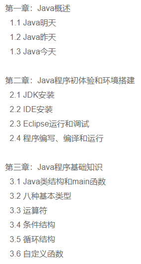
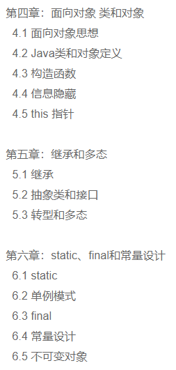
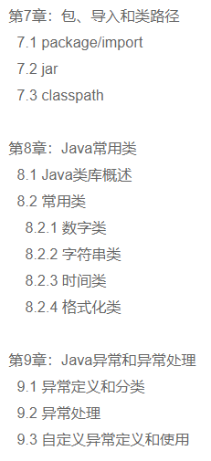
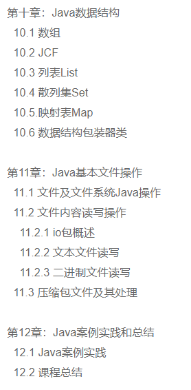
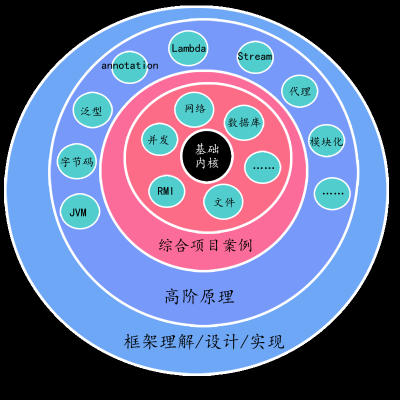
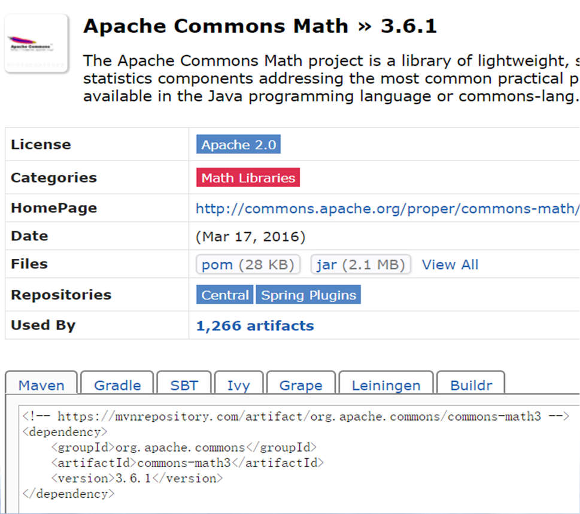
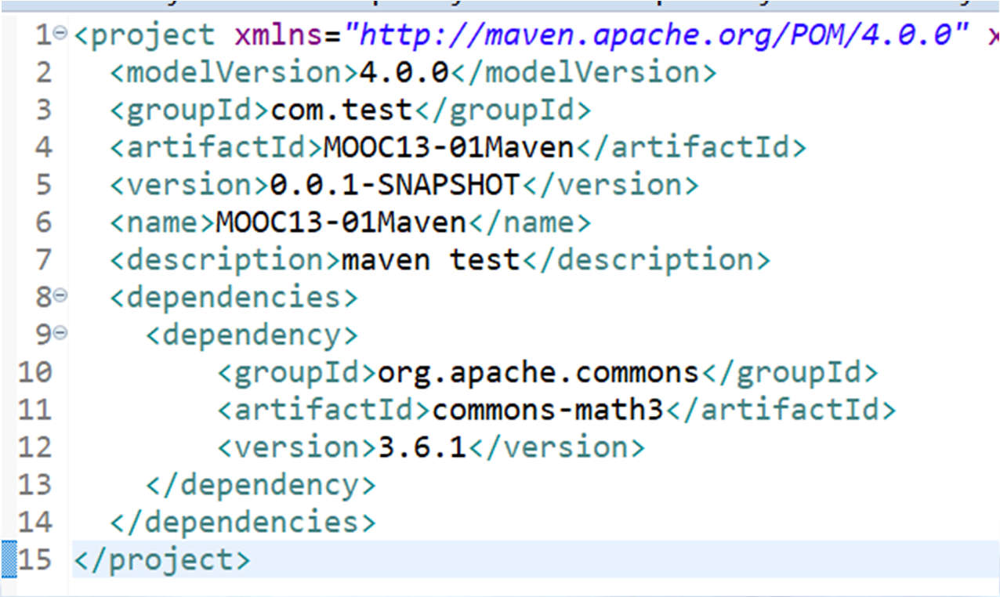

# [Java核心技术(进阶)](https://www.icourse163.org/course/ECNU-1003718005)

## 第零章 导学章 

### 第一节 导学

#### Java核心技术(基础)回顾









Java核心技术

- 12章，48节

- 着重Java基础原理：类/对象、继承、多态、异常、包/导入等
    了解Java常用类库：数字、字符串、时间等

- 了解Java基础数据结构：ArrayList、HashSet、HashMap等

- 初步应用实践：文件处理

- 两个综合性案例


需要熟记的内容

- javac.exe, java.exe, main, class, new

- abstract, interface, extends, implements, class cast (类转型)

- static, final, try-catch-finally

- package/import/classpath/jar/private/default/protected/public

- Object, Integer, Double, String, SringBuffer, ArrayList, HashSet,

- HashMap, Arrays/Collections, Comparable, File, BufferedReader,
  BufferedWriter


Java核心技术：基础原理
Java核心技术(进阶)内容：应用

- 庞大的第三方库

- 和其他系统/编程语言交互


Java核心技术进阶(本课程)
- Java构建工具：Maven
- Java单元测试：Junit
- 高级文件处理
- 多线程和并发
- 网络和邮件
- 数据库
- Java和其他语言交互


#### Java SE学习路径
Java SE 学习路径：原理-实践迭代
- 基础语言内核(以小见大)
- 外围应用扩展(花开漫天)
- 综合项目实战(多练多用)
- 高阶原理钻研(专项修炼)
- 框架理解/设计/实现(全面综合)




## 第一章 Maven

### 第一节 构建工具

Maven方法

- 在mvn中央仓库(mvnrepository.com)中搜索Commons Math


- 将Apache Commons Math依赖文本加到项目pom.xml中





#### Java构建工具

构建工具功能
- 自动帮程序员甄别和下载第三方库(jar)
- 完成整个项目编译(调用javac.exe)
- 完成整个项目单元测试流程(调用JUnit工具)
- 完成项目打包(jar/war等格式，调用jar.exe)

当前主要的Java构建工具

- Maven, Gradle, Ivy, Buildr , Ant 等

#### 代码(1) GCDTest.java

```java
import org.apache.commons.math3.util.ArithmeticUtils;

public class GcdTest {

    public static void main(String[] args) {
        //计算两个整数的公约数
        int a = ArithmeticUtils.gcd(361, 285);
        System.out.println(a);
    }
    
}
```

#### 代码(2) pom.xml

```xml
<project xmlns="http://maven.apache.org/POM/4.0.0"
         xmlns:xsi="http://www.w3.org/2001/XMLSchema-instance"
         xsi:schemaLocation="http://maven.apache.org/POM/4.0.0 http://maven.apache.org/xsd/maven-4.0.0.xsd">
    <modelVersion>4.0.0</modelVersion>
    <groupId>MOOC13-01Maven</groupId>
    <artifactId>MOOC13-01Maven</artifactId>
    <version>0.0.1-SNAPSHOT</version>

    <dependencies>
        <dependency>
            <groupId>org.apache.commons</groupId>
            <artifactId>commons-math3</artifactId>
            <version>3.6.1</version>
        </dependency>
    </dependencies>
</project>
```

### 第二节 Maven概念和实战

#### Maven repository(仓库)

Maven仓库存放和管理各种构件
- 仓库(本地用户的.m2文件夹)

- 仓库

  - 中央仓库
  - 阿里云仓库 http://maven.aliyun.com/nexus/content/groups/public/
  - 谷歌仓库

#### 代码(2) ChineseText.java

```java
import com.github.houbb.opencc4j.util.ZhConverterUtil;

public class ChineseText {
    
    public static void main(String[] args) {
    	String original = "生命在于运动";        
        // 简体中文转化为繁体中文
        String result = ZhConverterUtil.converToTraditional(original);
        System.out.println(result);
    }
    
}
```

#### 代码(3) pom.xml

```xml
<dependencies>
    <dependency>
        <groupId>com.github.houbb</groupId>
        <artifactId>opencc4j</artifactId>
        <version>1.0.2</version>
    </dependency>
</dependencies>
```

## 第二章 单元测试和JUnit

### 第一节 单元测试

软件测试分类 软件测试分类 软件测试分类 软件测试分类
- 单元（函数） vs 集成测试（多个函数组合）
- 白盒（程序员） vs 黑盒测试（使用者）
- 自动（程序） vs 手动测试（人工）
- 回归测试（修改旧代码后，重新进行测试）
- 压力测试

#### 代码 (1) Calculator/CalculatorTest

```java
public class Calculator {

    public int add(int a, int b) {
        return a + b;
    }

    public int subtract(int a, int b) {
        return a - b;
    }

    public int multiply(int a, int b) {
        return a * b;
    }

    public int divide(int a, int b) {
        return a / b;
    }
    
}
```

```java
public class CalculatorTest {

    public static void main(String[] args) {
        Calculator c = new Calculator();
        System.out.println(3 == c.add(1, 2));
        System.out.println(-1 == c.subtract(1, 2));
        System.out.println(3 == c.multiply(1, 2));
        System.out.println(0 == c.divide(1, 2));
    }
    
}
```

#### 代码 (2) CalculatorJunitTest

```java
import org.junit.Test;

import static org.junit.Assert.assertEquals;

public class CalculatorJunitTest {
    
    @Test
    public void testAdd() {
        assertEquals(3, new Calculator().add(1, 2));
    }

    @Test
    public void testSubtract() {
        assertEquals(-1, new Calculator().subtract(1, 2));
    }

    @Test
    public void testMultiply() {
        assertEquals(2, new Calculator().multiply(1, 2));
    }

    @Test
    public void testDivide() {
        assertEquals(0, new Calculator().divide(1, 2));
    }
    
}
```

#### 代码(3) pom.xml

```xml
<project xmlns:xsi="http://www.w3.org/2001/XMLSchema-instance"
         xmlns="http://maven.apache.org/POM/4.0.0"
         xsi:schemaLocation="http://maven.apache.org/POM/4.0.0 http://maven.apache.org/xsd/maven-4.0.0.xsd">

    <modelVersion>4.0.0</modelVersion>
    <groupId>com.test</groupId>
    <artifactId>MOOC14-01</artifactId>
    <version>0.0.1-SNAPSHOT</version>

    <dependencies>
        <!-- https://mvnrepository.com/artifact/junit/junit -->
        <dependency>
            <groupId>junit</groupId>
            <artifactId>junit</artifactId>
            <version>4.12</version>
        </dependency>
    </dependencies>

</project>
```

### 第二节 JUnit

####  JUnit简介
JUnit：一个Java语言的单元测试框架
- Kent Beck (极限编程) 和Erich Gamma (设计模式)建立的
- 是xUnit家族中最成功的一个
- 大部分的Java IDE都集成了JUnit作为单元测试工具
- 官网： https://junit.org
- 版本
  - 5 ：最后稳定版5.3.2， 2018.11发布
  - 4 ：最后稳定版4.12, 2014.12发布
  - 3 ：最后稳定版3.8.2, 2007.5发布

#### 代码(1) Triangle.java

```java
public class Triangle {

    public boolean judgeEdges(int a, int b, int c) {
        boolean result = true;
        //边长非负性
        if (a <= 0 || b <= 0 || c <= 0) {
            return false;
        }
        //两边和大于第三边
        if (a + b <= c) {
            result = false;
        }
        if (b + c <= a) {
            result = false;
        }
        if (c + a <= b) {
            result = false;
        }
        return result;
    }

}
```

#### 代码(2) TriangeTest.java

```java
import org.junit.Test;

import static org.junit.Assert.assertEquals;

public class TriangleTest {

    @Test
    public void test() {
        assertEquals(true, new Triangle().judgeEdges(1, 2, 3));
        //Assert.assertEquals(false, new Triangle().judgeEdges(1,2,3));
    }

}
```

## 第三章 高级文本处理

### 第一节Java字符编码

#### 字符编码(1)

字符编码
- 字符：0，a，我，①，の，……
- 计算机只用0和1, 1 bit(0 或者1)
- ASCII码
  - (American Standard Code for Information Interchange)
  - 美国信息交换标准代码，奠定计算机编码基础
  - 用一个字节(1 Byte=8 bits) 来存储a-z,A-Z,0-9和一些常用符号
  - 用于显示英语及西欧语言
  - 回车键(13, 00001101), 0(48, 00110000), A(65,01000001), a(97, 01100001

#### 字符编码(2)

字符编码

- ASCII编码采用1 Byte，8 bits，最多256个字符
- ASCII无法适应其他地方，如汉字数量有十几万
- 扩展编码(加字节)
  - ISO8859(1-15) 西欧语言
  - GB2132， GBK，GB18030 ASCII+中文
  - Big5 ASCII + 繁体中文
  - Shift_JIS ASCII+日文
  - ……
- Unicode 编码

#### 字符编码(3)

中文编码
- GB2312，1980年发布，7445个字符(6763个简体字)，包括拉丁字
母、希腊字母、日文平假名及片假名字母、俄语西里尔字母等
682个符号
- GBK，1995年发布，21886 个汉字和符号，包括GB2312和Big 5
- GB18030(2000, 2005两个版本)，70244个汉字和符号，包括GBK和
GB2312
- Big 5，繁体中文
- GB18030 > GBK > GB2312

#### 字符编码(4)

