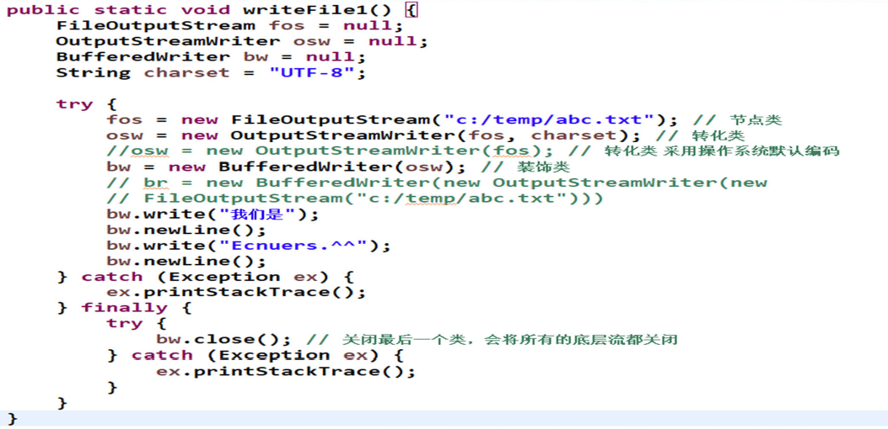

# [Java核心技术(进阶)](https://www.icourse163.org/course/ECNU-1003718005)

[TOC]

## 第零章 导学章 

### 第一节 导学

#### Java核心技术(基础)回顾


Java核心技术

- 12章，48节

- 着重Java基础原理：类/对象、继承、多态、异常、包/导入等
    了解Java常用类库：数字、字符串、时间等

- 了解Java基础数据结构：ArrayList、HashSet、HashMap等

- 初步应用实践：文件处理

- 两个综合性案例


需要熟记的内容

- javac.exe, java.exe, main, class, new

- abstract, interface, extends, implements, class cast (类转型)

- static, final, try-catch-finally

- package/import/classpath/jar/private/default/protected/public

- Object, Integer, Double, String, SringBuffer, ArrayList, HashSet,

- HashMap, Arrays/Collections, Comparable, File, BufferedReader,
  BufferedWriter


Java核心技术：基础原理
Java核心技术(进阶)内容：应用

- 庞大的第三方库

- 和其他系统/编程语言交互


Java核心技术进阶(本课程)
- Java构建工具：Maven
- Java单元测试：Junit
- 高级文件处理
- 多线程和并发
- 网络和邮件
- 数据库
- Java和其他语言交互


#### Java SE学习路径
Java SE 学习路径：原理-实践迭代
- 基础语言内核(以小见大)
- 外围应用扩展(花开漫天)
- 综合项目实战(多练多用)
- 高阶原理钻研(专项修炼)
- 框架理解/设计/实现(全面综合)


## 第一章 Maven

### 第一节 构建工具

Maven方法

- 在mvn中央仓库(mvnrepository.com)中搜索Commons Math


- 将Apache Commons Math依赖文本加到项目pom.xml中


#### Java构建工具

构建工具功能
- 自动帮程序员甄别和下载第三方库(jar)
- 完成整个项目编译(调用javac.exe)
- 完成整个项目单元测试流程(调用JUnit工具)
- 完成项目打包(jar/war等格式，调用jar.exe)

当前主要的Java构建工具

- Maven, Gradle, Ivy, Buildr , Ant 等

#### 代码(1) GCDTest.java

```java
import org.apache.commons.math3.util.ArithmeticUtils;

public class GcdTest {

    public static void main(String[] args) {
        //计算两个整数的公约数
        int a = ArithmeticUtils.gcd(361, 285);
        System.out.println(a);
    }
    
}
```

#### 代码(2) pom.xml

```xml
<project xmlns="http://maven.apache.org/POM/4.0.0"
         xmlns:xsi="http://www.w3.org/2001/XMLSchema-instance"
         xsi:schemaLocation="http://maven.apache.org/POM/4.0.0 http://maven.apache.org/xsd/maven-4.0.0.xsd">
    <modelVersion>4.0.0</modelVersion>
    <groupId>MOOC13-01Maven</groupId>
    <artifactId>MOOC13-01Maven</artifactId>
    <version>0.0.1-SNAPSHOT</version>

    <dependencies>
        <dependency>
            <groupId>org.apache.commons</groupId>
            <artifactId>commons-math3</artifactId>
            <version>3.6.1</version>
        </dependency>
    </dependencies>
</project>
```

### 第二节 Maven概念和实战

#### Maven repository(仓库)

Maven仓库存放和管理各种构件
- 仓库(本地用户的.m2文件夹)

- 仓库

  - 中央仓库
  - 阿里云仓库 http://maven.aliyun.com/nexus/content/groups/public/
  - 谷歌仓库

#### 代码(2) ChineseText.java

```java
import com.github.houbb.opencc4j.util.ZhConverterUtil;

public class ChineseText {
    
    public static void main(String[] args) {
    	String original = "生命在于运动";        
        // 简体中文转化为繁体中文
        String result = ZhConverterUtil.converToTraditional(original);
        System.out.println(result);
    }
    
}
```

#### 代码(3) pom.xml

```xml
<dependencies>
    <dependency>
        <groupId>com.github.houbb</groupId>
        <artifactId>opencc4j</artifactId>
        <version>1.0.2</version>
    </dependency>
</dependencies>
```

## 第二章 单元测试和JUnit

### 第一节 单元测试

软件测试分类 软件测试分类 软件测试分类 软件测试分类
- 单元（函数） vs 集成测试（多个函数组合）
- 白盒（程序员） vs 黑盒测试（使用者）
- 自动（程序） vs 手动测试（人工）
- 回归测试（修改旧代码后，重新进行测试）
- 压力测试

#### 代码 (1) Calculator/CalculatorTest

```java
public class Calculator {

    public int add(int a, int b) {
        return a + b;
    }

    public int subtract(int a, int b) {
        return a - b;
    }

    public int multiply(int a, int b) {
        return a * b;
    }

    public int divide(int a, int b) {
        return a / b;
    }
    
}
```

```java
public class CalculatorTest {

    public static void main(String[] args) {
        Calculator c = new Calculator();
        System.out.println(3 == c.add(1, 2));
        System.out.println(-1 == c.subtract(1, 2));
        System.out.println(3 == c.multiply(1, 2));
        System.out.println(0 == c.divide(1, 2));
    }
    
}
```

#### 代码 (2) CalculatorJunitTest

```java
import org.junit.Test;

import static org.junit.Assert.assertEquals;

public class CalculatorJunitTest {
    
    @Test
    public void testAdd() {
        assertEquals(3, new Calculator().add(1, 2));
    }

    @Test
    public void testSubtract() {
        assertEquals(-1, new Calculator().subtract(1, 2));
    }

    @Test
    public void testMultiply() {
        assertEquals(2, new Calculator().multiply(1, 2));
    }

    @Test
    public void testDivide() {
        assertEquals(0, new Calculator().divide(1, 2));
    }
    
}
```

#### 代码(3) pom.xml

```xml
<project xmlns:xsi="http://www.w3.org/2001/XMLSchema-instance"
         xmlns="http://maven.apache.org/POM/4.0.0"
         xsi:schemaLocation="http://maven.apache.org/POM/4.0.0 http://maven.apache.org/xsd/maven-4.0.0.xsd">

    <modelVersion>4.0.0</modelVersion>
    <groupId>com.test</groupId>
    <artifactId>MOOC14-01</artifactId>
    <version>0.0.1-SNAPSHOT</version>

    <dependencies>
        <!-- https://mvnrepository.com/artifact/junit/junit -->
        <dependency>
            <groupId>junit</groupId>
            <artifactId>junit</artifactId>
            <version>4.12</version>
        </dependency>
    </dependencies>

</project>
```

### 第二节 JUnit

####  JUnit简介
JUnit：一个Java语言的单元测试框架
- Kent Beck (极限编程) 和Erich Gamma (设计模式)建立的
- 是xUnit家族中最成功的一个
- 大部分的Java IDE都集成了JUnit作为单元测试工具
- 官网： https://junit.org
- 版本
  - 5 ：最后稳定版5.3.2， 2018.11发布
  - 4 ：最后稳定版4.12, 2014.12发布
  - 3 ：最后稳定版3.8.2, 2007.5发布

#### 代码(1) Triangle.java

```java
public class Triangle {

    public boolean judgeEdges(int a, int b, int c) {
        boolean result = true;
        //边长非负性
        if (a <= 0 || b <= 0 || c <= 0) {
            return false;
        }
        //两边和大于第三边
        if (a + b <= c) {
            result = false;
        }
        if (b + c <= a) {
            result = false;
        }
        if (c + a <= b) {
            result = false;
        }
        return result;
    }

}
```

#### 代码(2) TriangeTest.java

```java
import org.junit.Test;

import static org.junit.Assert.assertEquals;

public class TriangleTest {

    @Test
    public void test() {
        assertEquals(true, new Triangle().judgeEdges(1, 2, 3));
        //Assert.assertEquals(false, new Triangle().judgeEdges(1,2,3));
    }

}
```

## 第三章 高级文本处理

### 第一节Java字符编码

#### 字符编码(1)

字符编码
- 字符：0，a，我，①，の，……
- 计算机只用0和1, 1 bit(0 或者1)
- ASCII码
  - (American Standard Code for Information Interchange)
  - 美国信息交换标准代码，奠定计算机编码基础
  - 用一个字节(1 Byte=8 bits) 来存储a-z,A-Z,0-9和一些常用符号
  - 用于显示英语及西欧语言
  - 回车键(13, 00001101), 0(48, 00110000), A(65,01000001), a(97, 01100001

#### 字符编码(2)

字符编码

- ASCII编码采用1 Byte，8 bits，最多256个字符
- ASCII无法适应其他地方，如汉字数量有十几万
- 扩展编码(加字节)
  - ISO8859(1-15) 西欧语言
  - GB2132， GBK，GB18030 ASCII+中文
  - Big5 ASCII + 繁体中文
  - Shift_JIS ASCII+日文
  - ……
- Unicode 编码

#### 字符编码(3)

中文编码
- GB2312，1980年发布，7445个字符(6763个简体字)，包括拉丁字
母、希腊字母、日文平假名及片假名字母、俄语西里尔字母等
682个符号
- GBK，1995年发布，21886 个汉字和符号，包括GB2312和Big 5
- GB18030(2000, 2005两个版本)，70244个汉字和符号，包括GBK和
GB2312
- Big 5，繁体中文
- GB18030 > GBK > GB2312

#### 字符编码(4)

- Unicode(字符集)
  - 目标：不断扩充，存储全世界所有的字符
- 编码方案
  - UTF-8，兼容ASCII，变长(1-4个字节存储字符)，经济，方便传输
  - UTF-16，用变长(2-4个字节)来存储所有字符
  - UTF-32，用32bits(4个字节)存储所有字符

#### 字符编码(5)

- ANSI编码
  - Windows上非Unicode的默认编码(Windows code pages)
  - 在简体中文Windows操作系统中，ANSI 编码代表GBK 编码
  - 在繁体中文Windows操作系统中，ANSI编码代表Big5
  - 记事本默认是采用ANSI保存
  - ANSI编码文件不能在兼容使用


#### Java的字符编码

- 源文件编码：采用UTF-8编码
  - Eclipse，右键java文件，属性，resource，选择UTF-8
  - Eclipse，右键项目，属性，resource，选择UTF-8
- 程序内部采用UTF-16编码存储所有字符(不是程序员控制)
- 和外界(文本文件)的输入输出尽量采用UTF-8编码
  - 不能使用一种编码写入，换另外一种编码读取
- 通过CharsetTest.java, TxtReadUTF8.java, TxtWriteUTF8.java来了解Java的字符编码

#### 总结

- 总结
  - 了解字符编码的分类
  - 了解Java的字符编码和文件的输入输出

#### 代码(1) CharsetTest.java


#### 代码(2) TxtWriteUTF8.java



#### 代码(3) TxtReadUTF8.java


#### 代码(4) TxtWriteGBK.java


#### 代码(5) TxtReadGBK.java


#### 代码(6) StringTest.java


### 第二节Java国际化编程

#### 国际化编程

- Internationalization, 缩写为i18n.
- 多语言版本的软件
  - 一套软件，多个语言包
  - 根据语言设定，可以切换显示文本

#### Java国际化编程

- Java是第一个设计成支持国际化的编程语言
  - java.util.ResourceBundle 用于加载一个语言_国家语言包
  - java.util.Locale 定义一个语言_国家
  - java.text.MessageFormat 用于格式化带占位符的字符串
  - java.text.NumberFormat 用于格式化数字/金额
  - java.text.DateFormat用于格式化日期时间
  - java.time.format.DateTimeFormatter用于格式化日期时间
  (后4个Format参见《Java核心技术》第8章)

#### 国际化HelloWorld


#### Locale类

- Locale(zh_CN, en_US,…)
  - 语言，zh，en等
  - 国家/地区，CN，US等
  - 其他变量(variant)(几乎不用)
- Locale方法
  - getAvailableLocales()返回所有的可用Locale
  - getDefault()返回默认的Locale

#### 语言文件(1)

- 语言文件
  - 一个Properties文件(参见《Java核心技术》第十章)
  - 包含K-V对，每行一个K-V，例如：age=20
  - 命名规则
    - 包名+语言+国家地区.properties, (语言和国家地区可选)
    - message.properties
    - message_zh.properties
    - message_zh_CN.properties

#### 语言文件(2)

- 语言文件
  - 存储文件必须是ASCII码文件
  - 如果是ASCII以外的文字，必须用Unicode的表示\uxxxx
  - 可以采用native2ascii.exe (%JAVA_HOME%\bin目录下)进行转码


#### ResourceBundle类(1)

- ResourceBundle
  - 根据Locale要求，加载语言文件(Properties文件)
  - 存储语言集合中所有的K-V对
  - getString(String key) 返回所对应的value

#### ResourceBundle类(2)

- ResourceBundle 根据key找value的查找路径
  - 包名_当前Locale语言_当前Locale国家地区_当前Locale变量(variant)
  - 包名_当前Locale语言_当前Locale国家地区
  - 包名_当前Locale语言
  - 包名_默认Locale语言_默认Locale国家地区_默认Locale变量(variant)
  - 包名_默认Locale语言_默认Locale国家地区
  - 包名_默认Locale语言
  - 包名

#### 其他国际化

- 日期/时间国际化
  - DateTimeFormatter和Locale的结合
- 数字/金额国际化
  - NumberFormat和Locale结合

#### 总结
- Java国际化总结
  - ResourceBundle和Locale类
  - Properties文件的制作和native2ascii的转化

#### 代码(1) LocaleTest.java


#### 代码(2) HelloWorld.java


#### 代码(3) NewHelloWorld.java


#### 代码(4) NameTest.java


#### 代码(5) message_en_US.properties


#### 代码(6) message_zh_CN.properties


#### 代码(7) msg_zh_CN.properties


### 第三节Java高级字符串处理

#### 大纲

- 正则表达式
- 其他字符串操作
  - 集合和字符串互转
  - 字符串转义
  - 变量名字格式化
  - 从字符串到输入流

#### 正则表达式(1)
- 如何识别给定字符串为合法的邮箱地址
  - a@b.com √
  - a@@b.com ╳
  - a@b ╳
  - @a.com ╳
  - a@b@c.com ╳
- 如何认定一个字符串满足一定的规律

#### 正则表达式(2)
- 正则表达式(Regular Expression)
  - 规则表达式，计算机科学的一个基础概念
  - 用事先定义好的一些特定字符、及这些特定字符的组合，组成一个“规则字符串”
  - ^[A-Za-z]+$， 代表着一个字符串，只能由26英文字母组成
  - 作用
    - 测试字符串内的模式
    - 识别/替换文本
    - 提取文本

#### 正则表达式(3)
- 正则表达式独立于特定语言（Java, Perl, Python, PHP…）
- 正则表达式的匹配模板
  - 定界符
  - 原子
  - 特殊功能字符(元字符)
  - 模式修正符
- 推荐书籍：精通正则表达式(第三版)，Jeffrey E.F.Friedl著，余晟翻译，电子工业出版社，2012.

#### Java的正则表达式
- java.util.regex包
  - Pattern 正则表达式的编译表示
    - compile 编译一个正则表达式为Pattern对象
    - matcher 用Pattern对象匹配一个字符串，返回匹配结果
  - Matcher
    - Index Methods(位置方法) // start(), start(int group), end(), end(int group)
    - Study Methods(查找方法) // lookingAt(), find(), find(int start), matches()
    - Replacement Methods(替换方法) //replaceAll(String replacement)

- 查看例子

#### 其他字符串操作
-  字符串和集合互转
   -  [1,2,3], “1,2,3”
-  字符串转义
   -  对关键字符转义
-  变量名字格式化
   -  名字驼峰命名
-  字符串输入流
   -  将字符串转为一个输入流
   -  输入流可以定义为Scanner，这是Online Judge的实现原理

#### 总结
- 灵活使用正则表达式
- 多使用第三方库：Apache Commons Lang. Guava等
  - github.com
  - mvnrepository.com
  - www.open-open.com
  - ……

#### 代码(1) MatcherDemo.java


#### 代码(2) MatchesLooking.java


#### 代码(3) RegexDemo.java


### 第四章高级文件处理

#### 第一节XML简介

##### XML基本概念

- XML(eXtensible Markup Language)，www.w3.org
- 可扩展标记语言：意义+数据
- 标签可自行定义，具有自我描述性
- 纯文本表示，跨系统/平台/语言
- W3C标准(1998年，W3C发布了XML1.0，包括几乎所有的Unicode字符)

##### 书店示例(W3School)


##### XML结构

- 常规语法
  - 任何的起始标签都必须有一个结束标签。
  - 简化写法，例如，<name></name>可以写为<name/>。
  - 大小写敏感，如<name>和<Name>不一样。
  - 每个文件都要有一个根元素。
  - 标签必须按合适的顺序进行嵌套，不可错位。
  - 所有的特性都必须有值，且在值的周围加上引号。
  - 需要转义字符，如“<”需要用&lt;代替。
  - 注释：<!-- 注释内容-->

##### XML扩展(1)
- DTD(Document Type Definition)
  - 定义XML 文档的结构
  - 使用一系列合法的元素来定义文档结构
  - 可嵌套在xml文档中，或者在xml中引用


##### XML扩展(2)
- XML Schema(XSD，XML Schema Definition)
  - 定义XML 文档的结构, DTD的继任者
  - 支持数据类型，可扩展，功能更完善、强大
  - 采用xml编写


