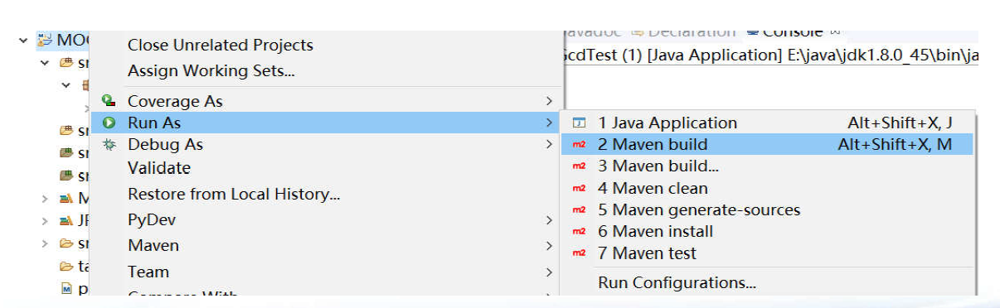
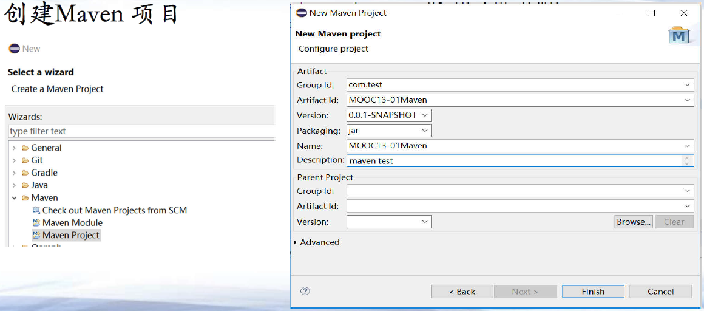
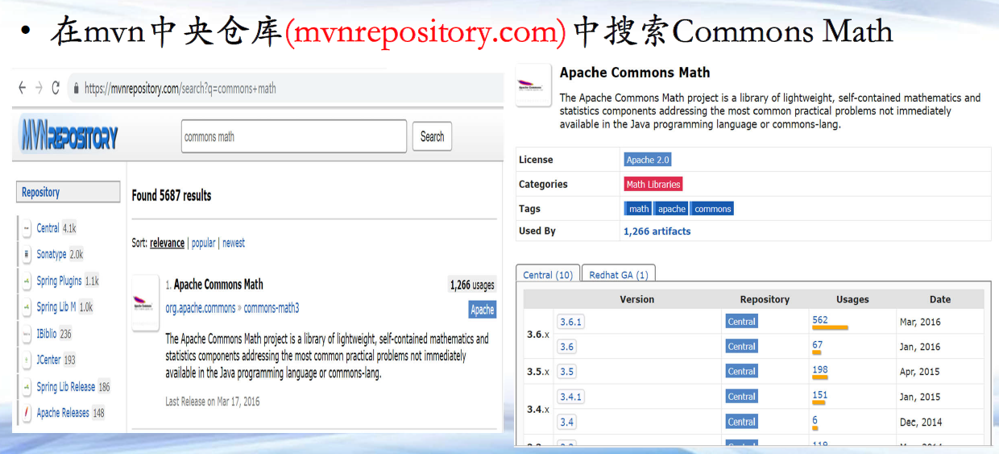
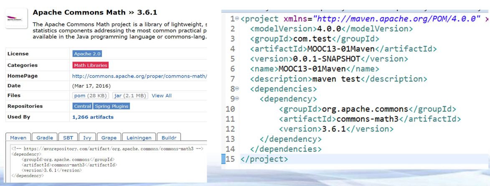
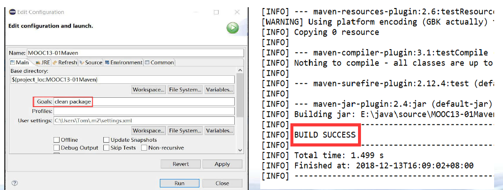
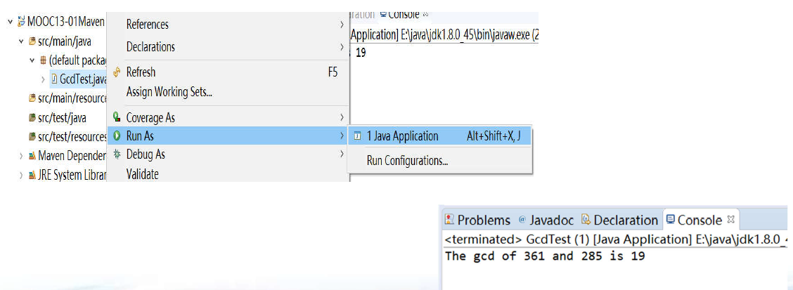

[TOC]

## 第一章 Maven

### 第一节 构建工具

#### Maven方法(1)

- 创建Maven项目





#### Maven方法(2)

- 在mvn中央仓库(mvnrepository.com)中搜索Commons Math



#### Maven方法(3)

- 将Apache Commons Math依赖文本加到项目pom.xml中



#### Maven方法(4)

- 使用Apache Commons Math类进行编码
- Maven编译和运行：右键项目->Run as ->Maven Build


#### Maven方法(5)
- Maven编译和运行：右键项目->Run as ->Maven Build



#### Maven方法(6)

- 程序运行：右键GcdTest，选择Run as -> Java Application



#### Java构建工具

**构建工具功能**

- 自动帮程序员甄别和下载第三方库(jar)
- 完成整个项目编译(调用javac.exe)
- 完成整个项目单元测试流程(调用JUnit工具)
- 完成项目打包(jar/war等格式，调用jar.exe)
- ......

**当前主要的Java构建工具**

- Maven, Gradle, Ivy, Buildr , Ant 等

#### 总结

**总结**

  - 了解传统模式下使用第三方库的痛点
  - 了解构建工具在项目开发中的作用
  - 初步了解Maven的构建过程

#### 代码(1) GCDTest.java

```java
import org.apache.commons.math3.util.ArithmeticUtils;

public class GcdTest {

    public static void main(String[] args) {
        //计算两个整数的公约数
        int a = ArithmeticUtils.gcd(361, 285);
        System.out.println(a);
    }
}
```


#### 代码(2) pom.xml

```xml
<project xmlns="http://maven.apache.org/POM/4.0.0"
         xmlns:xsi="http://www.w3.org/2001/XMLSchema-instance"
         xsi:schemaLocation="http://maven.apache.org/POM/4.0.0 http://maven.apache.org/xsd/maven-4.0.0.xsd">
    <modelVersion>4.0.0</modelVersion>
    <groupId>MOOC13-01Maven</groupId>
    <artifactId>MOOC13-01Maven</artifactId>
    <version>0.0.1-SNAPSHOT</version>

    <dependencies>
        <dependency>
            <groupId>org.apache.commons</groupId>
            <artifactId>commons-math3</artifactId>
            <version>3.6.1</version>
        </dependency>
    </dependencies>
</project>
```

### 第二节 Maven概念和实战

#### POM( Project Object Model )
- XML格式
- 包含了项目信息、依赖信息、构建信息
- 构件信息(artifact)
  - groupId：组织
  - artifactId：产品名称
  - version：版本

```xml
<groupId>org.apache.commons</groupId>
<artifactId>commons-math3</artifactId>
<version>3.6.1</version>
```

#### Maven repository(仓库)

**Maven仓库存放和管理各种构件**

- 仓库(本地用户的.m2文件夹)

- 仓库

  - 中央仓库
  - 阿里云仓库 http://maven.aliyun.com/nexus/content/groups/public/
  - 谷歌仓库
  - ...

#### Maven项目的目录结构
**基本目录结构**
- src
  - main
    - java/ 存放java文件
    - resources/ 存放程序资源文件
  - test/
    - java/ 存放测试程序
    - resources/ 存放测试程序资源文件
- pom.xml

#### 代码(1) GcdTest.java

```java
import org.apache.commons.math3.util.ArithmeticUtils;

public class GcdTest {

    public static void main(String[] args) {
        // 计算两个整数的公约数
        int a = ArithmeticUtils.gcd(361, 285);
        System.out.println(a);
    }
}
```

#### 代码(2) ChineseText.java

```java
import com.github.houbb.opencc4j.util.ZhConverterUtil;

public class ChineseText {
    
    public static void main(String[] args) {
    	String original = "生命在于运动";        
        // 简体中文转化为繁体中文
        String result = ZhConverterUtil.converToTraditional(original);
        System.out.println(result);
    }
    
}
```

#### 代码(3) pom.xml

```xml
<dependencies>
    <dependency>
        <groupId>org.apache.commons</groupId>
        <artifactId>commons-math3</artifactId>
        <version>3.6.1</version>
    </dependency>
    <dependency>
        <groupId>com.github.houbb</groupId>
        <artifactId>opencc4j</artifactId>
        <version>1.0.2</version>
    </dependency>
</dependencies>
```
##### 代码(4) GCDCalculator.java
```java
public class GCDCalculator {

    public static int gcd(int m, int n) {
        int r = 1;

        while (r != 0) {
            r = m % n;
            m = n;
            n = r;
        }

        r = m;
        return r;
    }

    public static void main(String[] args) {
        System.out.println(gcd(20, 10));
    }

}
```