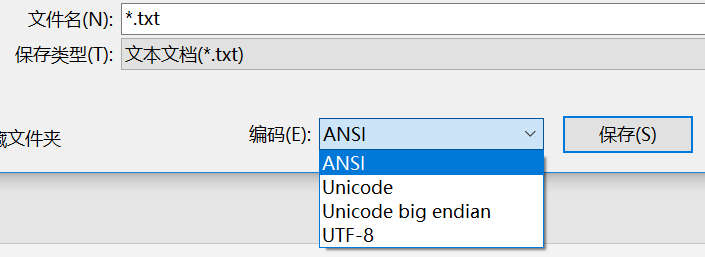
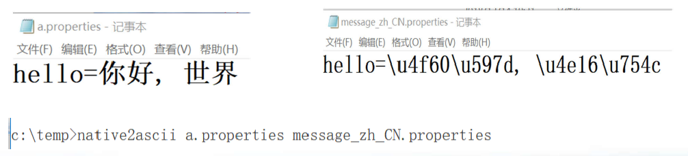
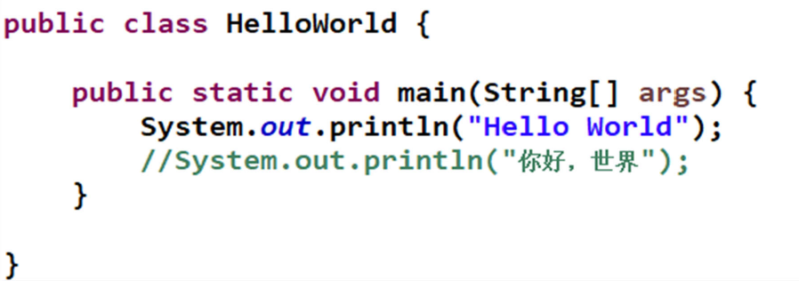
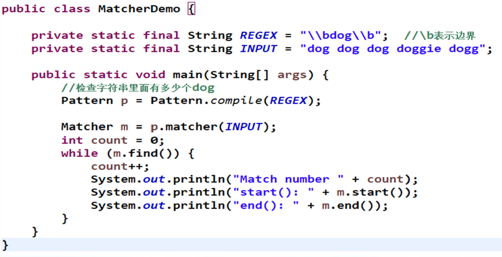
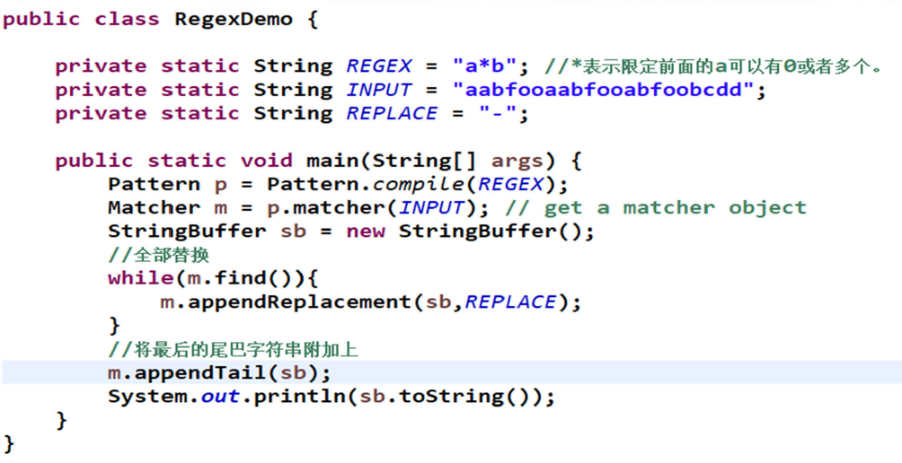

## 第三章 高级文本处理

### 第一节Java字符编码

#### 字符编码(1)

**字符编码**

- 字符：0，a，我，①，の，……
- 计算机只用0和1, 1 bit(0 或者1)
- ASCII码
  - (American Standard Code for Information Interchange)
  - 美国信息交换标准代码，奠定计算机编码基础
  - 用一个字节(1 Byte=8 bits) 来存储a-z,A-Z,0-9和一些常用符号
  - 用于显示英语及西欧语言
  - 回车键(13, 00001101), 0(48, 00110000), A(65,01000001), a(97, 01100001)

#### 字符编码(2)

**字符编码**

- ASCII编码采用1 Byte，8 bits，最多256个字符
- ASCII无法适应其他地方，如汉字数量有十几万
- 扩展编码(加字节)
  - ISO8859(1-15) 西欧语言
  - GB2132， GBK，GB18030 ASCII+中文
  - Big5 ASCII + 繁体中文
  - Shift_JIS ASCII+日文
  - ……
- Unicode 编码

#### 字符编码(3)

**中文编码**

- GB2312，1980年发布，7445个字符(6763个简体字)，包括拉丁字
  母、希腊字母、日文平假名及片假名字母、俄语西里尔字母等
  682个符号
- GBK，1995年发布，21886 个汉字和符号，包括GB2312和Big 5
- GB18030(2000, 2005两个版本)，70244个汉字和符号，包括GBK和
  GB2312
- Big 5，繁体中文
- GB18030 > GBK > GB2312

#### 字符编码(4)

**Unicode(字符集)**

  - 目标：不断扩充，存储全世界所有的字符

**编码方案**

  - UTF-8，兼容ASCII，变长(1-4个字节存储字符)，经济，方便传输
  - UTF-16，用变长(2-4个字节)来存储所有字符
  - UTF-32，用32bits(4个字节)存储所有字符

#### 字符编码(5)

**ANSI编码**

- Windows上非Unicode的默认编码(Windows code pages)
- 在简体中文Windows操作系统中，ANSI 编码代表GBK 编码
- 在繁体中文Windows操作系统中，ANSI编码代表Big5
- 记事本默认是采用ANSI保存
- ANSI编码文件不能在兼容使用



#### Java的字符编码

- 源文件编码：采用UTF-8编码
  - Eclipse，右键java文件，属性，resource，选择UTF-8
  - Eclipse，右键项目，属性，resource，选择UTF-8
- 程序内部采用UTF-16编码存储所有字符(不是程序员控制)
- 和外界(文本文件)的输入输出尽量采用UTF-8编码
  - 不能使用一种编码写入，换另外一种编码读取
- 通过CharsetTest.java, TxtReadUTF8.java, TxtWriteUTF8.java来了解Java的字符编码

#### 总结

- 总结
  - 了解字符编码的分类
  - 了解Java的字符编码和文件的输入输出

#### 代码(1) CharsetTest.java

```java
import java.nio.charset.Charset;
import java.util.Set;
import java.util.SortedMap;

public class CharsetTest {

    public static void main(String[] args) {
        //默认字符集 GBK
        Charset c = Charset.defaultCharset();
        System.out.println(c.name()); // UTF-8
        //输出所有的支持字符集
        SortedMap<String, Charset> sm = Charset.availableCharsets();
        Set<String> keyset = sm.keySet();
        System.out.println("Java 支持的所有字符集");
        for (String s : keyset) {
            System.out.println(s);
        }
        /*
         * Java 支持的所有字符集
         * Big5
         * Big5-HKSCS
         * CESU-8
         * EUC-JP
         * EUC-KR
         * GB18030
         * GB2312
         * GBK
         * IBM-Thai
         * IBM00858
         * IBM01140
         * IBM01141
         * IBM01142
         * IBM01143
         * IBM01144
         * IBM01145
         * IBM01146
         * IBM01147
         * IBM01148
         * IBM01149
         * IBM037
         * IBM1026
         * IBM1047
         * IBM273
         * IBM277
         * IBM278
         * IBM280
         * IBM284
         * IBM285
         * IBM290
         * IBM297
         * IBM420
         * IBM424
         * IBM437
         * IBM500
         * IBM775
         * IBM850
         * IBM852
         * IBM855
         * IBM857
         * IBM860
         * IBM861
         * IBM862
         * IBM863
         * IBM864
         * IBM865
         * IBM866
         * IBM868
         * IBM869
         * IBM870
         * IBM871
         * IBM918
         * ISO-2022-CN
         * ISO-2022-JP
         * ISO-2022-JP-2
         * ISO-2022-KR
         * ISO-8859-1
         * ISO-8859-13
         * ISO-8859-15
         * ISO-8859-2
         * ISO-8859-3
         * ISO-8859-4
         * ISO-8859-5
         * ISO-8859-6
         * ISO-8859-7
         * ISO-8859-8
         * ISO-8859-9
         * JIS_X0201
         * JIS_X0212-1990
         * KOI8-R
         * KOI8-U
         * Shift_JIS
         * TIS-620
         * US-ASCII
         * UTF-16
         * UTF-16BE
         * UTF-16LE
         * UTF-32
         * UTF-32BE
         * UTF-32LE
         * UTF-8
         * windows-1250
         * windows-1251
         * windows-1252
         * windows-1253
         * windows-1254
         * windows-1255
         * windows-1256
         * windows-1257
         * windows-1258
         * windows-31j
         * x-Big5-HKSCS-2001
         * x-Big5-Solaris
         * x-euc-jp-linux
         * x-EUC-TW
         * x-eucJP-Open
         * x-IBM1006
         * x-IBM1025
         * x-IBM1046
         * x-IBM1097
         * x-IBM1098
         * x-IBM1112
         * x-IBM1122
         * x-IBM1123
         * x-IBM1124
         * x-IBM1364
         * x-IBM1381
         * x-IBM1383
         * x-IBM300
         * x-IBM33722
         * x-IBM737
         * x-IBM833
         * x-IBM834
         * x-IBM856
         * x-IBM874
         * x-IBM875
         * x-IBM921
         * x-IBM922
         * x-IBM930
         * x-IBM933
         * x-IBM935
         * x-IBM937
         * x-IBM939
         * x-IBM942
         * x-IBM942C
         * x-IBM943
         * x-IBM943C
         * x-IBM948
         * x-IBM949
         * x-IBM949C
         * x-IBM950
         * x-IBM964
         * x-IBM970
         * x-ISCII91
         * x-ISO-2022-CN-CNS
         * x-ISO-2022-CN-GB
         * x-iso-8859-11
         * x-JIS0208
         * x-JISAutoDetect
         * x-Johab
         * x-MacArabic
         * x-MacCentralEurope
         * x-MacCroatian
         * x-MacCyrillic
         * x-MacDingbat
         * x-MacGreek
         * x-MacHebrew
         * x-MacIceland
         * x-MacRoman
         * x-MacRomania
         * x-MacSymbol
         * x-MacThai
         * x-MacTurkish
         * x-MacUkraine
         * x-MS932_0213
         * x-MS950-HKSCS
         * x-MS950-HKSCS-XP
         * x-mswin-936
         * x-PCK
         * x-SJIS_0213
         * x-UTF-16LE-BOM
         * X-UTF-32BE-BOM
         * X-UTF-32LE-BOM
         * x-windows-50220
         * x-windows-50221
         * x-windows-874
         * x-windows-949
         * x-windows-950
         * x-windows-iso2022jp
         */
    }
}

```

#### 代码(2) TxtWriteUTF8.java

```java
import java.io.*;

public class TxtWriteUTF8 {
	public static void main(String[] args) {
		writeFile1();
		System.out.println("===================");
		//writeFile2(); // JDK 7及以上才可以使用
	}

	public static void writeFile1() {
		FileOutputStream fos = null;
		OutputStreamWriter osw = null;
		BufferedWriter bw = null;
		String charset = "UTF-8"; 
		
		try {
			fos = new FileOutputStream("c:/temp/abc.txt"); // 节点类
			osw = new OutputStreamWriter(fos, charset); // 转化类
			//osw = new OutputStreamWriter(fos); // 转化类 采用操作系统默认编码
			bw = new BufferedWriter(osw); // 装饰类
			// br = new BufferedWriter(new OutputStreamWriter(new
			// FileOutputStream("c:/temp/abc.txt")))
			bw.write("我们是");
			bw.newLine();
			bw.write("Ecnuers.^^");
			bw.newLine();
		} catch (Exception ex) {
			ex.printStackTrace();
		} finally {
			try {
				bw.close(); // 关闭最后一个类，会将所有的底层流都关闭
			} catch (Exception ex) {
				ex.printStackTrace();
			}
		}
	}

	public static void writeFile2() {
		//try-resource 语句，自动关闭资源
		try (BufferedWriter bw = new BufferedWriter(new OutputStreamWriter(new FileOutputStream("c:/temp/abc.txt")))) {
			bw.write("我们是");
			bw.newLine();
			bw.write("Ecnuers.^^");
			bw.newLine();
		} catch (Exception ex) {
			ex.printStackTrace();
		}
	}

}

```

#### 代码(3) TxtReadUTF8.java

```java
import java.io.BufferedReader;
import java.io.FileInputStream;
import java.io.InputStreamReader;
import java.util.HashMap;

public class TxtReadUTF8 {
	public static void main(String[] args) {
		readFile1();
		System.out.println("===================");
		//readFile2(); //JDK 7及以上才可以使用
	}

	public static void readFile1() {
		FileInputStream fis = null;
		InputStreamReader isr = null;
		BufferedReader br = null;
		String charset = "UTF-8"; 
		
		try {
			fis = new FileInputStream("c:/temp/abc.txt"); // 节点类
			isr = new InputStreamReader(fis, charset); // 转化类
			//isr = new InputStreamReader(fis); //采用操作系统默认编码
			br = new BufferedReader(isr); // 装饰类
			// br = new BufferedReader(new InputStreamReader(new
			// FileInputStream("c:/temp/abc.txt")))
			String line;
			while ((line = br.readLine()) != null) // 每次读取一行
			{
				System.out.println(line);
			}
		} catch (Exception ex) {
			ex.printStackTrace();
		} finally {
			try {
				br.close(); // 关闭最后一个类，会将所有的底层流都关闭
			} catch (Exception ex) {
				ex.printStackTrace();
			}
		}
	}

	public static void readFile2() {
		String line;
		//try-resource 语句，自动关闭资源
		try (BufferedReader in = new BufferedReader(new InputStreamReader(new FileInputStream("c:/temp/abc.txt")))) {
			while ((line = in.readLine()) != null) {
				System.out.println(line);
			}
		}
		catch(Exception ex)
		{
			ex.printStackTrace();
		}
	}
}

```

#### 代码(4) TxtWriteGBK.java

```java
import java.io.*;

public class TxtWriteGBK {
	public static void main(String[] args) {
		writeFile1();
		System.out.println("===================");
		//writeFile2(); // JDK 7及以上才可以使用
	}

	public static void writeFile1() {
		FileOutputStream fos = null;
		OutputStreamWriter osw = null;
		BufferedWriter bw = null;
		String charset = "GBK"; 
		
		try {
			fos = new FileOutputStream("c:/temp/abc.txt"); // 节点类
			osw = new OutputStreamWriter(fos, charset); // 转化类
			//osw = new OutputStreamWriter(fos); // 转化类 采用操作系统默认编码
			bw = new BufferedWriter(osw); // 装饰类
			// br = new BufferedWriter(new OutputStreamWriter(new
			// FileOutputStream("c:/temp/abc.txt")))
			bw.write("我们是");
			bw.newLine();
			bw.write("Ecnuers.^^");
			bw.newLine();
		} catch (Exception ex) {
			ex.printStackTrace();
		} finally {
			try {
				bw.close(); // 关闭最后一个类，会将所有的底层流都关闭
			} catch (Exception ex) {
				ex.printStackTrace();
			}
		}
	}

	public static void writeFile2() {
		//try-resource 语句，自动关闭资源
		try (BufferedWriter bw = new BufferedWriter(new OutputStreamWriter(new FileOutputStream("c:/temp/abc.txt")))) {
			bw.write("我们是");
			bw.newLine();
			bw.write("Ecnuers.^^");
			bw.newLine();
		} catch (Exception ex) {
			ex.printStackTrace();
		}
	}

}

```

#### 代码(5) TxtReadGBK.java

```java
import java.io.BufferedReader;
import java.io.FileInputStream;
import java.io.InputStreamReader;
import java.util.HashMap;

public class TxtReadGBK {
	public static void main(String[] args) {
		readFile1();
		System.out.println("===================");
		//readFile2(); //JDK 7及以上才可以使用
	}

	public static void readFile1() {
		FileInputStream fis = null;
		InputStreamReader isr = null;
		BufferedReader br = null;
		String charset = "GBK"; 
		
		try {
			fis = new FileInputStream("c:/temp/abc.txt"); // 节点类
			isr = new InputStreamReader(fis, charset); // 转化类
			//isr = new InputStreamReader(fis); //采用操作系统默认编码
			br = new BufferedReader(isr); // 装饰类
			// br = new BufferedReader(new InputStreamReader(new
			// FileInputStream("c:/temp/abc.txt")))
			String line;
			while ((line = br.readLine()) != null) // 每次读取一行
			{
				System.out.println(line);
			}
		} catch (Exception ex) {
			ex.printStackTrace();
		} finally {
			try {
				br.close(); // 关闭最后一个类，会将所有的底层流都关闭
			} catch (Exception ex) {
				ex.printStackTrace();
			}
		}
	}
}

	

```

#### 代码(6) StringTest.java

```java
import java.io.UnsupportedEncodingException;
import java.nio.charset.StandardCharsets;

public class StringTest {

    public static void main(String[] args) throws UnsupportedEncodingException {
        String a = "我是中国人";

        String b = new String(a.getBytes(StandardCharsets.UTF_8), "GBK");
        System.out.println(b); // 鎴戞槸涓浗浜�

        String c = new String(b.getBytes("GBK"), StandardCharsets.UTF_8);
        System.out.println(c); // 我是中国�?

    }

}
```

### 第二节Java国际化编程

#### 国际化编程

- Internationalization, 缩写为i18n.
- 多语言版本的软件
  - 一套软件，多个语言包
  - 根据语言设定，可以切换显示文本


#### Java国际化编程

- Java是第一个设计成支持国际化的编程语言
  - java.util.ResourceBundle 用于加载一个语言_国家语言包
  - java.util.Locale 定义一个语言_国家
  - java.text.MessageFormat 用于格式化带占位符的字符串
  - java.text.NumberFormat 用于格式化数字/金额
  - java.text.DateFormat用于格式化日期时间
  - java.time.format.DateTimeFormatter用于格式化日期时间
    (后4个Format参见《Java核心技术》第8章)

#### Locale类

- Locale(zh_CN, en_US,…)
  - 语言，zh，en等
  - 国家/地区，CN，US等
  - 其他变量(variant)(几乎不用)
- Locale方法
  - getAvailableLocales()返回所有的可用Locale
  - getDefault()返回默认的Locale

#### 语言文件(1)

- 语言文件
  - 一个Properties文件(参见《Java核心技术》第十章)
  - 包含K-V对，每行一个K-V，例如：age=20
  - 命名规则
    - 包名+语言+国家地区.properties, (语言和国家地区可选)
    - message.properties
    - message_zh.properties
    - message_zh_CN.properties

#### 语言文件(2)

- 语言文件
  - 存储文件必须是ASCII码文件
  - 如果是ASCII以外的文字，必须用Unicode的表示\uxxxx
  - 可以采用native2ascii.exe (%JAVA_HOME%\bin目录下)进行转码



#### ResourceBundle类(1)

- ResourceBundle
  - 根据Locale要求，加载语言文件(Properties文件)
  - 存储语言集合中所有的K-V对
  - getString(String key) 返回所对应的value

#### ResourceBundle类(2)

- ResourceBundle 根据key找value的查找路径
  - 包名_当前Locale语言_当前Locale国家地区_当前Locale变量(variant)
  - 包名_当前Locale语言_当前Locale国家地区
  - 包名_当前Locale语言
  - 包名_默认Locale语言_默认Locale国家地区_默认Locale变量(variant)
  - 包名_默认Locale语言_默认Locale国家地区
  - 包名_默认Locale语言
  - 包名

#### 其他国际化

- 日期/时间国际化
  - DateTimeFormatter和Locale的结合
- 数字/金额国际化
  - NumberFormat和Locale结合

#### 总结
- Java国际化总结
  - ResourceBundle和Locale类
  - Properties文件的制作和native2ascii的转化

#### 代码(1) LocaleTest.java


#### 代码(2) HelloWorld.java



#### 代码(3) NewHelloWorld.java


#### 代码(4) NameTest.java


#### 代码(5) message_en_US.properties


#### 代码(6) message_zh_CN.properties


#### 代码(7) msg_zh_CN.properties


### 第三节Java高级字符串处理

#### 大纲

- 正则表达式
- 其他字符串操作
  - 集合和字符串互转
  - 字符串转义
  - 变量名字格式化
  - 从字符串到输入流

#### 正则表达式(1)
- 如何识别给定字符串为合法的邮箱地址
  - a@b.com √
  - a@@b.com ╳
  - a@b ╳
  - @a.com ╳
  - a@b@c.com ╳
- 如何认定一个字符串满足一定的规律

#### 正则表达式(2)
- 正则表达式(Regular Expression)
  - 规则表达式，计算机科学的一个基础概念
  - 用事先定义好的一些特定字符、及这些特定字符的组合，组成一个“规则字符串”
  - ^[A-Za-z]+$， 代表着一个字符串，只能由26英文字母组成
  - 作用
    - 测试字符串内的模式
    - 识别/替换文本
    - 提取文本

#### 正则表达式(3)
- 正则表达式独立于特定语言（Java, Perl, Python, PHP…）
- 正则表达式的匹配模板
  - 定界符
  - 原子
  - 特殊功能字符(元字符)
  - 模式修正符
- 推荐书籍：精通正则表达式(第三版)，Jeffrey E.F.Friedl著，余晟翻译，电子工业出版社，2012.

#### Java的正则表达式
- java.util.regex包
  - Pattern 正则表达式的编译表示
    - compile 编译一个正则表达式为Pattern对象
    - matcher 用Pattern对象匹配一个字符串，返回匹配结果
  - Matcher
    - Index Methods(位置方法) // start(), start(int group), end(), end(int group)
    - Study Methods(查找方法) // lookingAt(), find(), find(int start), matches()
    - Replacement Methods(替换方法) //replaceAll(String replacement)

- 查看例子

#### 其他字符串操作
-  字符串和集合互转
   -  [1,2,3], “1,2,3”
-  字符串转义
   -  对关键字符转义
-  变量名字格式化
   -  名字驼峰命名
-  字符串输入流
   -  将字符串转为一个输入流
   -  输入流可以定义为Scanner，这是Online Judge的实现原理

#### 总结
- 灵活使用正则表达式
- 多使用第三方库：Apache Commons Lang. Guava等
  - github.com
  - mvnrepository.com
  - www.open-open.com
  - ……

#### 代码(1) MatcherDemo.java



#### 代码(2) MatchesLooking.java


#### 代码(3) RegexDemo.java

